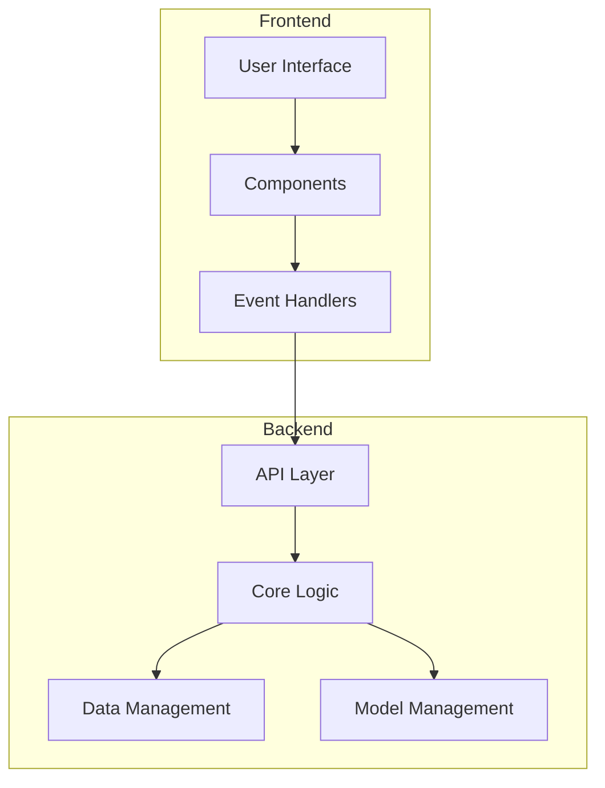
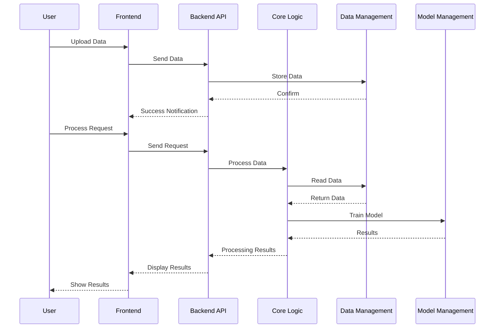
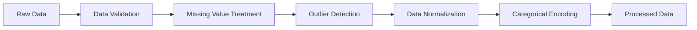
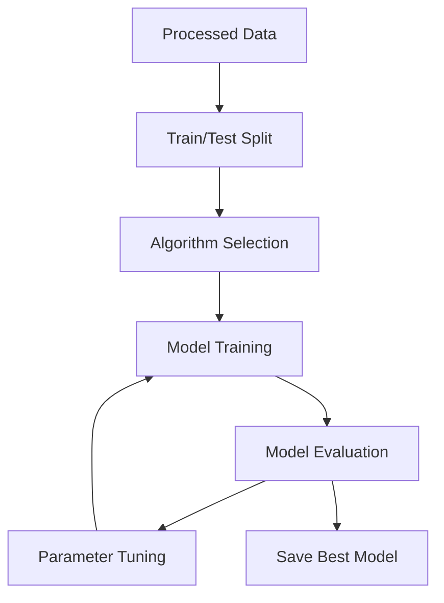

# Data Mining System - Technical Documentation

## 1. System Overview

The Data Mining System is a comprehensive platform for data analysis and machine learning, built with a modern microservices architecture. The system is designed to be scalable, maintainable, and user-friendly.

### 1.1 Overall Architecture

### 1.2 Data Processing Flow

## 2. System Components

### 2.1 Backend (FastAPI)

#### 2.1.1 API Layer (`backend/api/`)

- **RESTful Endpoints**

  - `/api/data/upload`: Upload data
  - `/api/data/preprocess`: Preprocess data
  - `/api/model/train`: Train model
  - `/api/model/predict`: Make predictions
  - `/api/model/save`: Save model
  - `/api/visualize`: Generate visualizations

- **Request Processing**
  - Input validation
  - Error handling
  - Rate limiting
  - CORS configuration

#### 2.1.2 Core Logic (`backend/core/`)

- **Data Preprocessing**

  - Missing value handling
  - Outlier detection and treatment
  - Data normalization
  - Categorical encoding

- **Model Training**
  - Classification
  - Regression
  - Clustering
  - Model evaluation

#### 2.1.3 Data Management (`backend/data/`)

- **Data Management**
  - Data storage
  - Data validation
  - Format conversion
  - Data caching

#### 2.1.4 Model Management (`backend/models/`)

- **Model Management**
  - Model storage
  - Version control
  - Monitoring
  - Deployment

### 2.2 Frontend (Dash)

#### 2.2.1 Components (`frontend/components/`)

- **User Interface**
  - Data upload
  - Preprocessing configuration
  - Model configuration
  - Results display

#### 2.2.2 Callbacks (`frontend/callbacks/`)

- **Event Handling**
  - Upload callbacks
  - Preprocessing callbacks
  - Training callbacks
  - Visualization callbacks

## 3. Processing Workflows

### 3.1 Preprocessing Workflow

### 3.2 Model Training Workflow

## 4. Machine Learning Algorithms

### 4.1 Classification

- **Logistic Regression**

  - Binary and multiclass support
  - Regularization options
  - Class weight balancing

- **Random Forest**

  - Ensemble learning
  - Feature importance
  - Hyperparameter tuning

- **XGBoost**

  - Gradient boosting
  - Early stopping
  - Cross-validation

- **SVM**
  - Linear and non-linear kernels
  - Class weight support
  - Probability estimates

### 4.2 Regression

- **Linear Regression**

  - Multiple regression
  - Regularization options

- **Random Forest**

  - Ensemble regression
  - Feature importance

- **XGBoost**

  - Gradient boosting
  - Custom loss functions

- **SVR**
  - Support vector regression
  - Kernel options

### 4.3 Clustering

- **K-Means**

  - K selection methods
  - Initialization options

- **DBSCAN**

  - Density-based clustering
  - Noise handling

- **Hierarchical Clustering**
  - Agglomerative clustering
  - Linkage methods

## 5. Model Evaluation

### 5.1 Classification Metrics

- Accuracy
- Precision
- Recall
- F1-score
- ROC curve
- AUC score
- Confusion matrix

### 5.2 Regression Metrics

- MSE
- RMSE
- MAE
- R² score
- Adjusted R²

### 5.3 Clustering Metrics

- Silhouette score
- Calinski-Harabasz index
- Davies-Bouldin index

## 6. Security

### 6.1 Data Security

- Input validation
- Data encryption
- Secure file handling
- Access control

### 6.2 API Security

- Rate limiting
- Request validation
- Error handling
- CORS configuration

### 6.3 Model Security

- Model validation
- Input sanitization
- Output validation
- Model versioning

## 7. Performance

### 7.1 Optimization

- Caching
- Batch processing
- Parallel processing
- Memory management

### 7.2 Scalability

- Horizontal scaling
- Load balancing
- Resource management
- Performance monitoring

## 8. Deployment

### 8.1 Requirements

- Python 3.8+
- Virtual environment
- Dependencies management
- Environment variables

### 8.2 Configuration

- API settings
- Database settings
- Model settings
- Security settings

### 8.3 Monitoring

- Logging
- Error tracking
- Performance metrics
- Resource usage

## 9. Development Roadmap

### 9.1 New Features

- Deep learning support
- Automated ML
- Model deployment
- Real-time predictions

### 9.2 Improvements

- Enhanced visualization
- Advanced preprocessing
- Model interpretability
- Performance optimization
