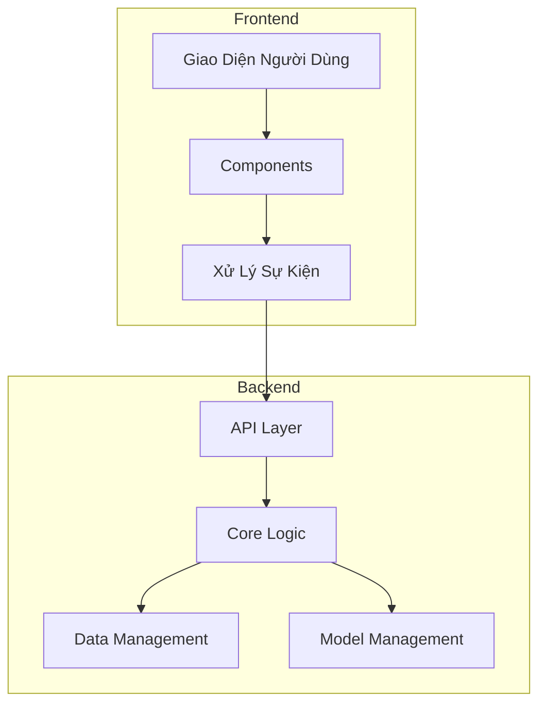
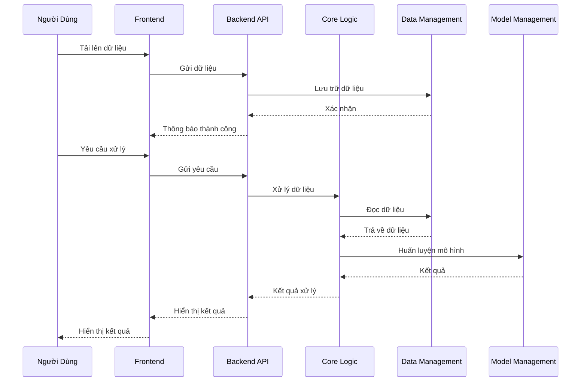
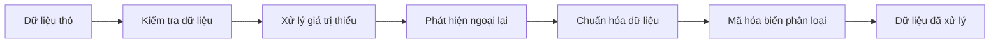
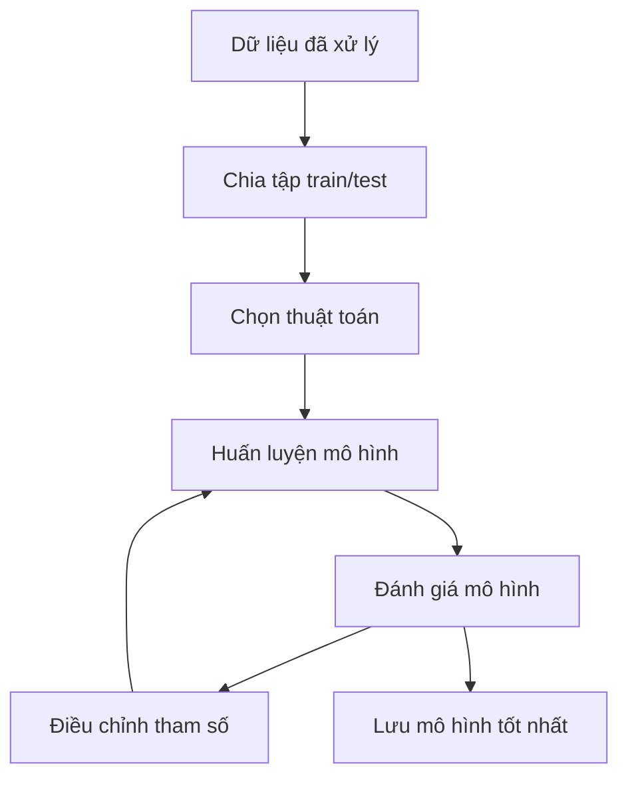

# Hệ Thống Khai Thác Dữ Liệu - Tài Liệu Kỹ Thuật

## 1. Tổng Quan Hệ Thống

Hệ thống Khai Thác Dữ Liệu là một nền tảng toàn diện cho việc phân tích dữ liệu và học máy, được xây dựng với kiến trúc microservices hiện đại. Hệ thống được thiết kế để dễ dàng mở rộng, bảo trì và thân thiện với người dùng.

### 1.1 Kiến Trúc Tổng Thể

### 1.2 Luồng Xử Lý Dữ Liệu

## 2. Các Thành Phần Hệ Thống

### 2.1 Backend (FastAPI)

#### 2.1.1 API Layer (`backend/api/`)

- **Endpoints RESTful**

  - `/api/data/upload`: Tải lên dữ liệu
  - `/api/data/preprocess`: Tiền xử lý dữ liệu
  - `/api/model/train`: Huấn luyện mô hình
  - `/api/model/predict`: Dự đoán
  - `/api/model/save`: Lưu mô hình
  - `/api/visualize`: Tạo biểu đồ

- **Xử Lý Request**
  - Validation dữ liệu đầu vào
  - Xử lý lỗi
  - Rate limiting
  - CORS configuration

#### 2.1.2 Core Logic (`backend/core/`)

- **Tiền Xử Lý Dữ Liệu**

  - Xử lý giá trị thiếu
  - Phát hiện và xử lý ngoại lai
  - Chuẩn hóa dữ liệu
  - Mã hóa biến phân loại

- **Huấn Luyện Mô Hình**
  - Phân loại
  - Hồi quy
  - Phân cụm
  - Đánh giá mô hình

#### 2.1.3 Data Management (`backend/data/`)

- **Quản Lý Dữ Liệu**
  - Lưu trữ dữ liệu
  - Validation dữ liệu
  - Chuyển đổi định dạng
  - Cache dữ liệu

#### 2.1.4 Model Management (`backend/models/`)

- **Quản Lý Mô Hình**
  - Lưu trữ mô hình
  - Version control
  - Monitoring
  - Deployment

### 2.2 Frontend (Dash)

#### 2.2.1 Components (`frontend/components/`)

- **Giao Diện Người Dùng**
  - Upload dữ liệu
  - Cấu hình tiền xử lý
  - Cấu hình mô hình
  - Hiển thị kết quả

#### 2.2.2 Callbacks (`frontend/callbacks/`)

- **Xử Lý Sự Kiện**
  - Upload callbacks
  - Preprocessing callbacks
  - Training callbacks
  - Visualization callbacks

## 3. Quy Trình Xử Lý

### 3.1 Quy Trình Tiền Xử Lý

### 3.2 Quy Trình Huấn Luyện Mô Hình

## 4. Các Thuật Toán Học Máy

### 4.1 Phân Loại

- **Hồi Quy Logistic**

  - Hỗ trợ phân loại nhị phân và đa lớp
  - Tùy chọn regularization
  - Cân bằng trọng số lớp

- **Random Forest**

  - Ensemble learning
  - Feature importance
  - Tuning hyperparameters

- **XGBoost**

  - Gradient boosting
  - Early stopping
  - Cross-validation

- **SVM**
  - Linear và non-linear kernels
  - Hỗ trợ class weights
  - Probability estimates

### 4.2 Hồi Quy

- **Linear Regression**

  - Multiple regression
  - Regularization options

- **Random Forest**

  - Ensemble regression
  - Feature importance

- **XGBoost**

  - Gradient boosting
  - Custom loss functions

- **SVR**
  - Support vector regression
  - Kernel options

### 4.3 Phân Cụm

- **K-Means**

  - Phương pháp chọn K
  - Tùy chọn khởi tạo

- **DBSCAN**

  - Density-based clustering
  - Xử lý nhiễu

- **Hierarchical Clustering**
  - Agglomerative clustering
  - Phương pháp linkage

## 5. Đánh Giá Mô Hình

### 5.1 Metrics Phân Loại

- Accuracy
- Precision
- Recall
- F1-score
- ROC curve
- AUC score
- Confusion matrix

### 5.2 Metrics Hồi Quy

- MSE
- RMSE
- MAE
- R² score
- Adjusted R²

### 5.3 Metrics Phân Cụm

- Silhouette score
- Calinski-Harabasz index
- Davies-Bouldin index

## 6. Bảo Mật

### 6.1 Bảo Mật Dữ Liệu

- Validation đầu vào
- Mã hóa dữ liệu
- Xử lý file an toàn
- Kiểm soát truy cập

### 6.2 Bảo Mật API

- Rate limiting
- Request validation
- Error handling
- CORS configuration

### 6.3 Bảo Mật Mô Hình

- Model validation
- Input sanitization
- Output validation
- Model versioning

## 7. Hiệu Năng

### 7.1 Tối Ưu Hóa

- Caching
- Batch processing
- Parallel processing
- Memory management

### 7.2 Khả Năng Mở Rộng

- Horizontal scaling
- Load balancing
- Resource management
- Performance monitoring

## 8. Triển Khai

### 8.1 Yêu Cầu

- Python 3.8+
- Virtual environment
- Quản lý dependencies
- Environment variables

### 8.2 Cấu Hình

- API settings
- Database settings
- Model settings
- Security settings

### 8.3 Monitoring

- Logging
- Error tracking
- Performance metrics
- Resource usage

## 9. Kế Hoạch Phát Triển

### 9.1 Tính Năng Mới

- Hỗ trợ deep learning
- Automated ML
- Model deployment
- Dự đoán real-time

### 9.2 Cải Tiến

- Nâng cao visualization
- Tiền xử lý nâng cao
- Model interpretability
- Tối ưu hiệu năng
